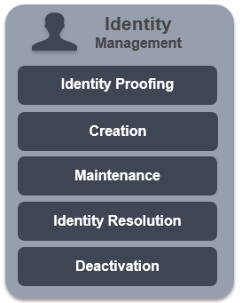
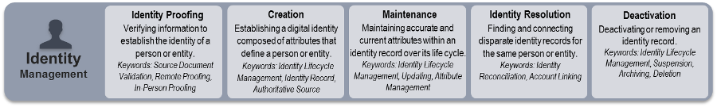

Identity Management is the set of practices that allow an
organization to establish, maintain, and terminate identities.

An **IDENTITY** is the set of characteristics (also called 
“attributes”) that describe an individual within a given 
context:

* Your identity within the context of the Department of 
Motor Vehicles (DMV) is different from your identity 
within the context of your bank.

* Similarly, a person who is both a government 
contractor and an Army Reservist will have two 
identities, one in each context. These identities are 
often called “personas”.

Identities change and evolve over time (you may get a 
promotion, change your hair color, or receive additional 
training) and may be terminated (you may turn in your 
driver’s license when you move to another state), but 
identities do not expire.

**IDENTITY PROOFING** is the process by which an identity is 
first established. This process can be simple or complicated, 
depending on the Level of Assurance (strength) that is 
required of the identity:

* The process for a frequent shopper program at the 
local grocery store is weak.

* The processes required by the DMV is stronger, 
typically requiring multiple forms of evidence, such as 
leases, mortgages, and utility bills.

* The process required by the Federal Government is 
stronger still.

An **IDENTIFIER** is a unique attribute that can be used to 
locate a specific identity within its context:

* While the DMV may issue many driver’s licenses bearing 
the same name (there is more than one John Smith in 
the state), each will have a different driver’s license 
number.

## Identity Management Services
The Identity Management services in the Federal ICAM architecture include Proofing, Creation, Maintenance, Resolution and Deactivation.

**Identity Proofing**  

> Verifying information to establish the identity of a person or entity.  
_Keywords_: Source Document Validation, Remote Proofing, In-Person Proofing

**Creation**  

> Establishing a digital identity composed of attributes that define a person or entity.  
_Keywords_: Identity Lifecycle Management, Identity Record, Authoritative Source  

**Maintenance**  

> Maintaining accurate and current attributes within an identity record over its life cycle.  
_Keywords_: Identity Lifecycle Management, Updating, Attribute Management  

**Identity Resolution**  

> Finding and connecting disparate identity records for the same person or entity.  
_Keywords_: Identity Reconciliation, Account Linking  

**Deactivation**  

> Deactivating or removing an identity record.  
_Keywords_: Identity Lifecycle Management, Suspension, Archiving, Deletion

