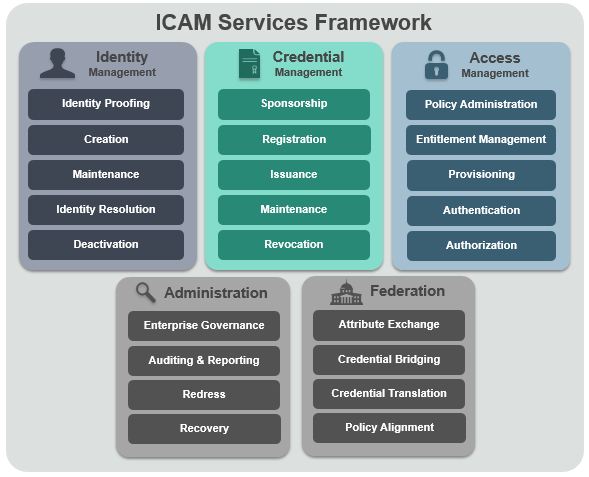
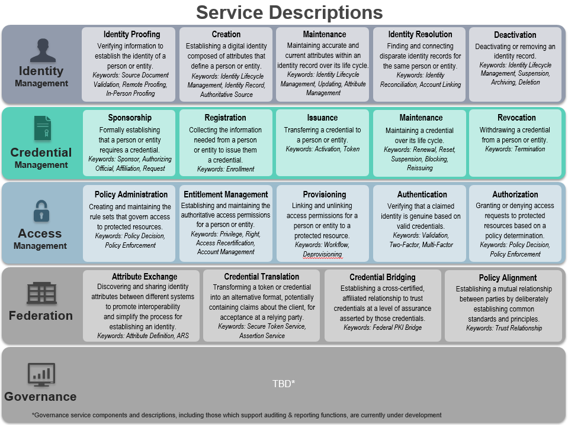

The Services Framework identifies the services that provide functionality within the scope of ICAM. 
The Services Framework is a tool for you to help translate between the business requirements and technical solutions.  

The ICAM Services are defined for the five conceptual practice areas, with descriptions and simple diagrams for you to use: 

* [Identity Management](../identity)
* [Credential Management](../credentials)
* [Access Management](../access)
* [Federation](../federation)
* [Governance](../governance)

Each service area has individual services and descriptions of the functionality with related keywords:  

#### Who is the Audience?

ICAM Program Managers, and Information Technology Enterprise Architects

