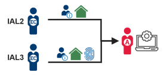
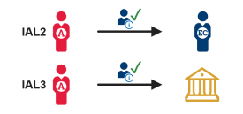

{:align="right"}

Before you can create a credential and assign it to an individual, that person must provide proof of their claimed identity. Identity proofing is the process by which a federal agency collects and verifies information about a person to establish an enterprise identity.

The location or information that a person needs to access informs the Identity Assurance Level (IAL), which informs the elements you should require from that person for identity proofing. There are three IALs; however, federal agencies require a minimum of IAL3 for employees or contractors with recurring access to government resources, so these use cases do not include IAL1.

This use case describes the high-level steps to proof an identity at IAL2 or IAL3. Depending on the required IAL, you may require increasingly more information from an employee or contractor or partner along with additional verification steps. The information provided by the employee or contractor is also known as identity evidence. Identity evidence may be physical, such as passports, driver’s licenses, and birth certificates.

- **IAL2** - first and last name, email address, and address of record, supported by appropriate identity documentation and verified as strong.
- **IAL3** - first and last name, email address, address of record, and fingerprints, supported by appropriate identity documentation and verified as superior.

For more information about identity proofing and IALs, see <a href="https://pages.nist.gov/800-63-3/">NIST SP 800-63-A</a> (Table 4-1).

---

## Procedure

In this use case, an administrator needs to collect or manage identity data for an employee or contractor for the purpose of creating an enterprise identity record and maintaining it throughout its lifecycle.

| **1. Collect identity information**   | **IAL2** *(In-person or remote)* - The employee or contractor presents identity information, like first name, last name, and address of record. **IAL3** *(In-person or supervised remote)* - The employee or contractor presents identity information, like first name, last name, and address of record, and biometric data like fingerprints. |
| **2. Verify the identity information**   | **IAL2** - The administrator confirms the information provided is valid and current by comparing photo identification to the individual, or confirming contact information, ensuring it matches the provided documentation. **IAL3** - The administrator verifies all information with the issuing organization. *Result:* The individual’s identity has been successfully proofed at IAL2, or IAL3. |

<table class="tg">
  <tr>
    <td class="tg-0pky">1. Collect identity information </td>
    <td class="tg-0pky">IAL2 (In-person or remote) - The employee or contractor presents identity information, like first name, last name, and address of record. IAL3 (In-person or supervised remote) - The employee or contractor presents identity information, like first name, last name, and address of record, and biometric data like fingerprints.</td>
  </tr>
  <tr>
    <td class="tg-0pky">2. Verify the identity information </td>
    <td class="tg-0pky">IAL2 - The administrator confirms the information provided is valid and current by comparing photo identification to the individual, or confirming contact information, ensuring it matches the provided documentation. IAL3 - The administrator verifies all information with the issuing organization. Result: The individual’s identity has been successfully proofed at IAL2, or IAL3.</td>
  </tr>
</table>

## Examples

- I want to proof the identity of an employee or contractor to verify that the individual is who she says she is, so that she can be issued a unique enterprise credential.
- Prospective employee or contractor has filled out their information in an HR system and requires IAL3 proofing, and minimum background investigations. The prospective employee/contractor is then scheduled for in-person proofing. The prospective employee/contractor brings required identity documentation, where the information is verified using approved documentation and biometrics are captured.

## Next Steps

Create and issue a credential and assign access entitlements.
