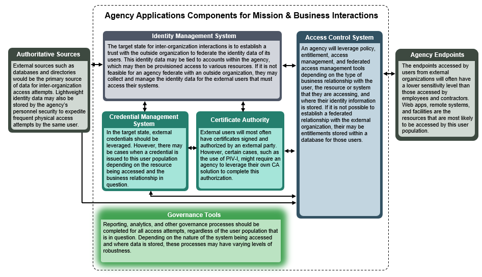
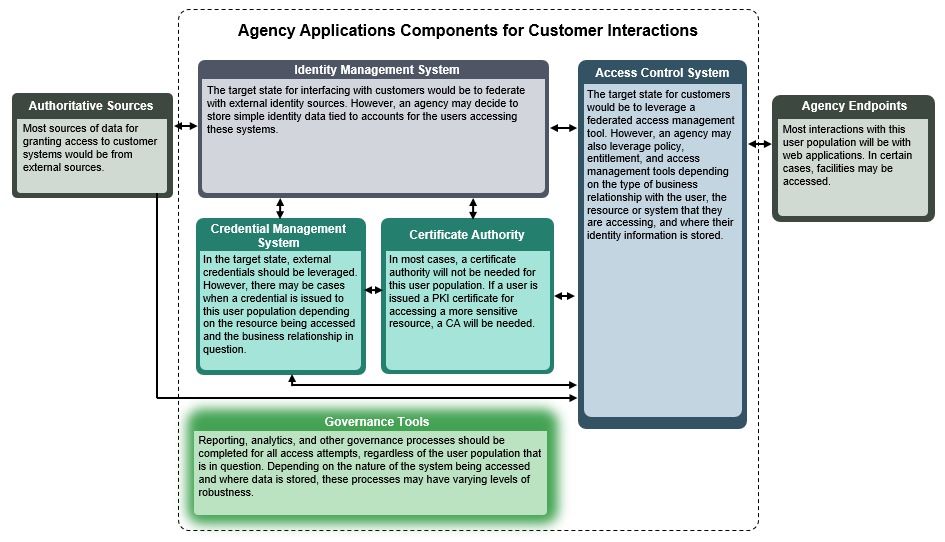

The applications interface diagram depicts 3 different views of the software and applications an agency would use to provide ICAM services, and how these applications interface with each other. 

The application names have been abstracted and simplified as to remain product and vendor neutral.  In practice, vendor solutions may offer an application or a bundled suite of software that delivers solutions across several of the boxes seen here.  For example, looking under the Access Control Systems category, a vendor might offer an application that provides both policy management and access management functionality. 

This diagram should serve as a reference for Federal technologists and ICAM program managers looking to understand how the software solutions they currently have fit together – and how any solutions they are considering adding would fit in.  

Each diagram has an accompanying description that provides more information about the boxes and categories.

##Audience
ICAM Enterprise Architects; Implementation specialists

##Purpose
To depict the common applications that support business processes within an enterprise ICAM suite and for various user populations.

  <h3>Enterprise Applications Interface Diagram</h3>
  

    This view shows the wide range of applications an agency would use to manage an ICAM program for its own employees and contractors. This is the most expansive view, and it includes applications to manage identity stores, issue credentials, and grant access to a wide range of resources for a large body of individuals.  
	
    
  

  <h3>Mission & Business View</h3>
  

  This view shows the type of applications an agency would use to manage its ICAM interactions with another organization, such as a private sector company or an academic institution. The applications that primarily apply to this view remain in white, while the others have been faded out.
 
 
  The target state for the federal enterprise involves establishing a federated environment to work with organizations outside of government.  In a federated environment, some elements, like a Credential Management System, will become less relevant to this view.  See the diagram description for more information.

    
	
  

  <h3>Customer View</h3>
  

  This view shows the applications an agency would use to offer services, primarily via web apps, to a large number of customers.  For most agencies, this would be in the context of delivering citizen services via the internet.  The applications that primarily apply to this view remain in white, while the others have been faded out.
 
 
  In a mature state, the Federal enterprise might be able to rely on third-party authentication services, such as those offered by Google, Facebook, and Amazon, in order to authenticate citizens using federal web apps, which would affect the other elements that are leveraged for this user population.  See the diagram description for more information.

    
	
    </ul>
  

##Background & Key Revisions
* Consolidation: Combined several target state diagrams to create a single, enterprise-wide view of ICAM systems.
* Graphics: Updated visuals to align with other architecture elements and increase readability.
* Descriptions: Included descriptions of each system and the business service that they assist in delivering.
