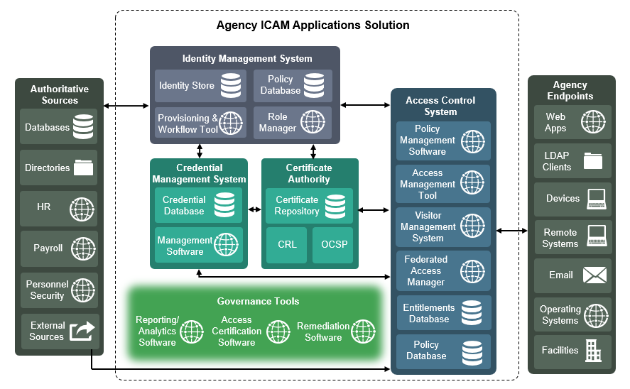
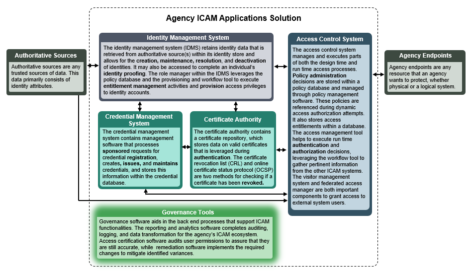
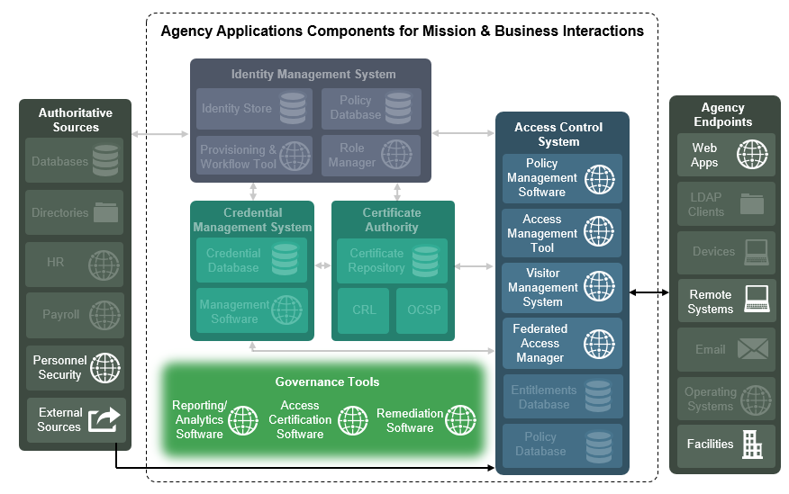
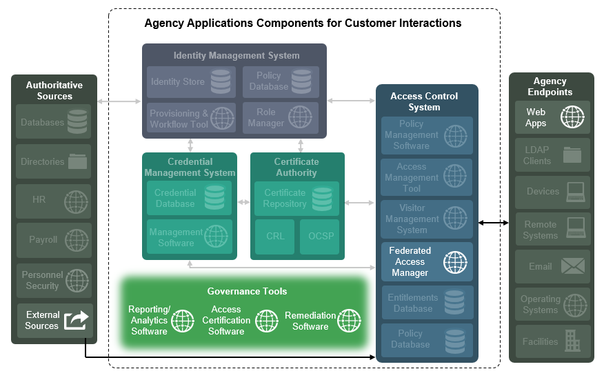

Depicts the general applications and systems that support the delivery of ICAM business services within an enterprise and how they interface with each other. Consists of two elements:

* Diagram – A graphic showing generic applications and software components and their connections in relation to each other.
* Applications Descriptions – Describes the general purpose of each application or system within the diagram and which business services they assist in delivering.

##Audience
ICAM Enterprise Architects; Implementation specialists

##Purpose
To depict the common applications that support business processes within an enterprise ICAM suite.

  <h3>Full Applications Interface Diagram</h3>
  

    
    <h3>Considerations</h3>
    <ul><li>This diagram depicts broad categories of applications that an enterprise ICAM solution might contain. The titles that have been given to specific components in this diagram are characterizations of the type of functionality that an application may provide, and are not meant to be indicative of a specific product or bound the functionalities of an enterprise's applications or software solution.</li></ul>
  

  <h3>Full Applications Interface Diagram Descriptions</h3>
  

    
  

  <h3>G2B Applications Interface Diagram</h3>
  

    
    <h3>Considerations</h3>
    <ul>
      <li>This diagram depicts broad categories of applications that an enterprise ICAM solution might contain when providing G2B services.</li>
      <li>Some tools, such as Policy Management and Access Management, may or may not be required depending on the business relationship and technical integration.</li>
      <li>Most integration will likely be handled by a federated relationship.</li>
    </ul>
  

  <h3>G2C Applications Interface Diagram</h3>
  

    
    <h3>Considerations</h3>
    <ul>
      <li>This diagram depicts broad categories of applications that an enterprise ICAM solution might contain when providing G2C services.</li>
      <li>Most G2C interactions will be handled through interactions with web applications.</li>
      <li>Credentialing will generally be handled in a federated relationship with external (non-federal) credential providers.</li>
      <li>PKI Certificates may be issued to a small, select portion of this user community for more sensitive communications.</li>
    </ul>
  

##Background & Key Revisions
* Consolidation: Combined several target state diagrams to create a single, enterprise-wide view of ICAM systems.
* Graphics: Updated visuals to align with other architecture elements and increase readability.
* Descriptions: Included descriptions of each system and the business service that they assist in delivering.

##External References

##Examples
