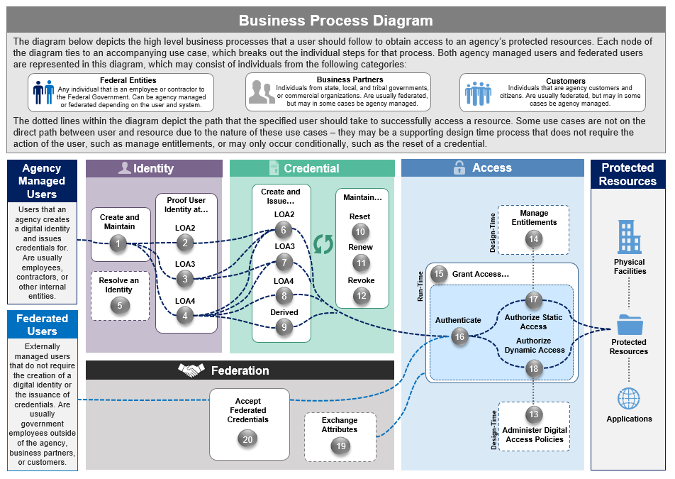

Presents the structure of organizational processes and activities performed by users interacting with systems to produce process outcomes. It also serves as a holistic summary of the use cases and how they fit together through a linear and functional view.

•	Agency-Managed Flow– Shows the set of business processes an agency should leverage to create and maintain digital identities and credentials to enable access for its employees and contractors. 

•	Federated flow – Shows the set of processes an agency should leverage to enable access to users, including employees and contractors external to their organization, mission and business partners, and customers.

##Audience

ICAM Enterprise Architects; Business line and/or unit managers

##Purpose

To provide a holistic, functional view of ICAM business processes and how they apply to different user populations. Used as a tool to navigate the various use cases.

