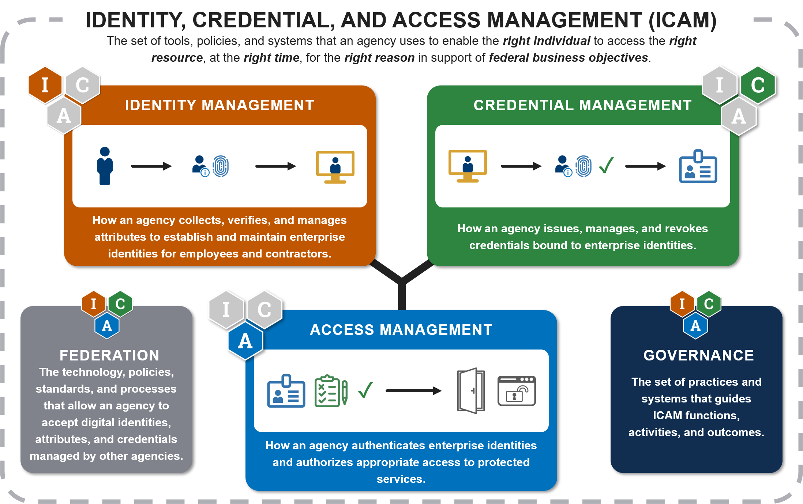

Provides a high-level overview of ICAM using visuals to explain basic concepts, terms & relationships. 

It is broken into the functional areas of Identity, Credential, and Access Management with two main components in each box:

•	Category Description & Storyboard – A narrative and visual explanation of the concept, designed to work together to help the non-technical reader understand basic terms and functionality.

•	Services – A list of the services that fall under this concept. Provides a bridge to the Services Framework.

The diagram also shows category descriptions and services for ICAM’s two overarching concepts, 
Governance and Federation, to reiterate the importance of the role they play in good ICAM.

##Audience

Senior government leaders, agency executives, non-technical readers.

##Purpose

To provide an entry point to understanding what ICAM is and how it operationally works. To establish visuals and common terms that subsequent artifacts build on.

##Key Updates

•	Categories: Centered diagram on the three core functions of ICAM (Identity, Credential, and Access); included the 2 overarching concepts (Governance and Federation).

•	Content: Dropped any visuals showing complex businesses processes in order to have a simpler diagram that’s easy to understand.  These more complex processes are now tackled in subsequent artifacts.

•	Design: Established a color scheme, symbology, and visual style that subsequent products use to build knowledge.

