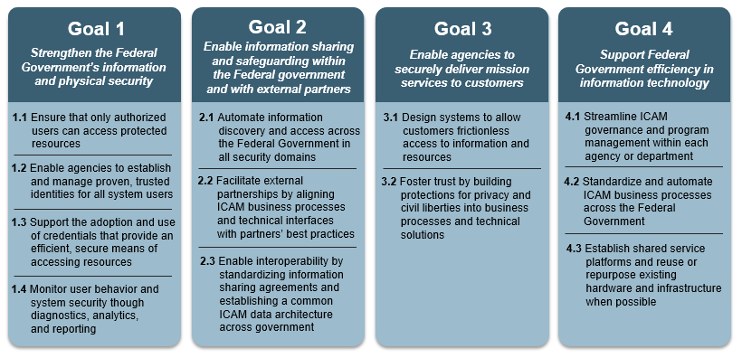

Provides the strategic goals and objectives of government-wide implementation of ICAM. Terms are defined as follows:

- Goals – Broad statements of what FICAM intends to accomplish to meet government-wide aspirations.
- Objectives – General actions that should be met to accomplish the goals.

##Audience

Senior government leaders, agency executives, ICAM program leadership responsible for setting program strategy

##Purpose

To establish and bound the strategy driving ICAM implementation. Used as a tool to ensure that agency programs and initiatives map back to government-wide aspirations.

##Key Revisions

- Relevance to ICAM: Ensured all language clearly conveys not just a general cybersecurity goal but how ICAM contributes to that goal’s success.

- Goals vs. Objectives: Revised language so ICAM Goals accomplish high level aspirations of the Federal Government, whereas Objectives discuss actionable ways to achieve those goals.

- Removed ‘compliance’-focused goal which stated that FICAM will comply with relevant regulations, in favor of showing throughout the document how ICAM inherently contributes to Federal compliance.  

