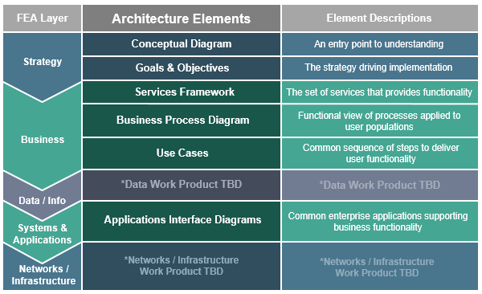

The FICAM Architecture, as described in the FICAM Roadmap and Implementation Guidance, was created in 2009 to provide a common segment architecture for identity, credential, and access management for use by federal agencies. While the FICAM Roadmap is a comprehensive source of information that has played a guiding role for ICAM programs and implementation efforts across the Federal Government, it is a lengthy document that does not translate well to today’s digital society. 

With that in mind, ICAM specialists from across the Federal Government have come together to create an updated FICAM Architecture that is concise, easy to understand, and visually appealing, while reflecting the latest advances in cybersecurity, enterprise architecture, and the ICAM policy landscape. The updated FICAM Architecture will use the internet as its platform to convey information in navigable, user-friendly way.

The updated FICAM Architecture will use the internet as its platform to convey information in navigable, user-friendly way. The FICAM Architecture outlines a common framework for ICAM within the Federal government and is meant as a robust, scalable tool, equally useful to enterprise architects developing their agency’s program and to those new to ICAM. It describes concepts and standard models that can be applied to most agencies and are meant as a guide to help agencies improve their programs – not as a requirement or a mandate. While the core ICAM elements and principles described in this document should be a part of all Federal ICAM programs, they also leave room for individual agency implementations to vary.  

Each element of the updated Architecture aligns with one of the six sub-architecture domains described in the Common Approach to Federal Enterprise Architecture (FEA). Below is an outline of the FICAM Architecture elements and their alignment to the FEA layers:

To support a collaborative, iterative environment for the Federal ICAM Community, the working versions of each artifact have been released to this site for continuous refinement and improvement. Stakeholders and partners are encouraged to regularly review these artifacts and provide comments and recommended edits on how they can be improved, clarified or updated, to support agency knowledge and ICAM implementation. Source files, final records, and future revisions will be managed by the FICAM Program, with guidance and support from the CIO Council’s ICAMSC.
